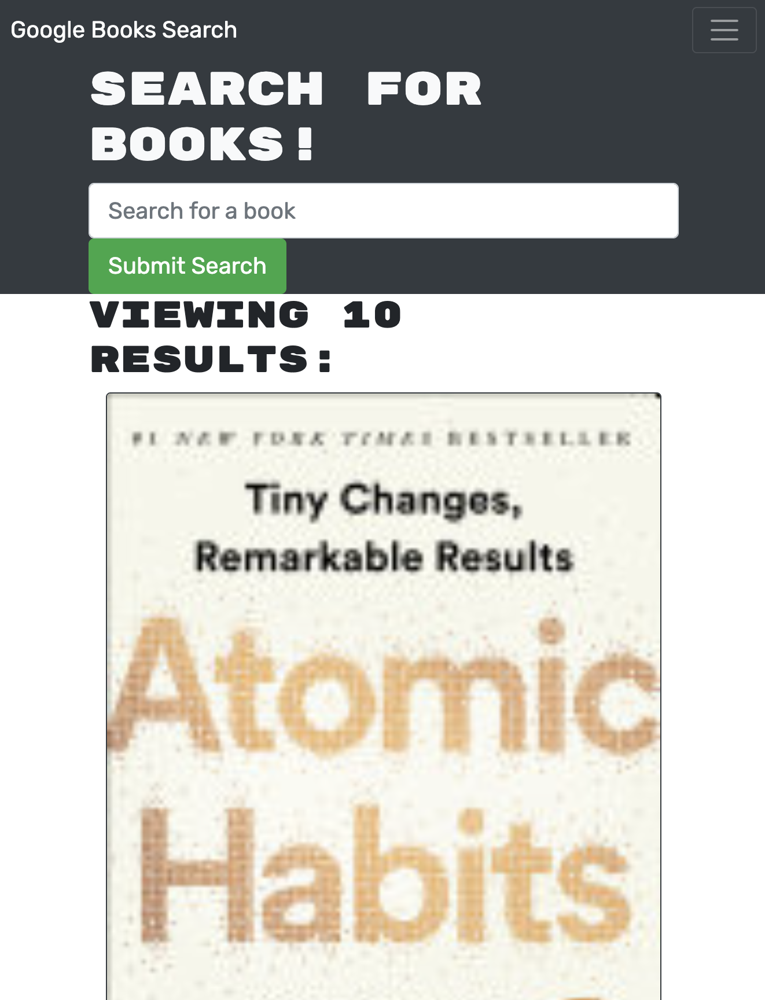
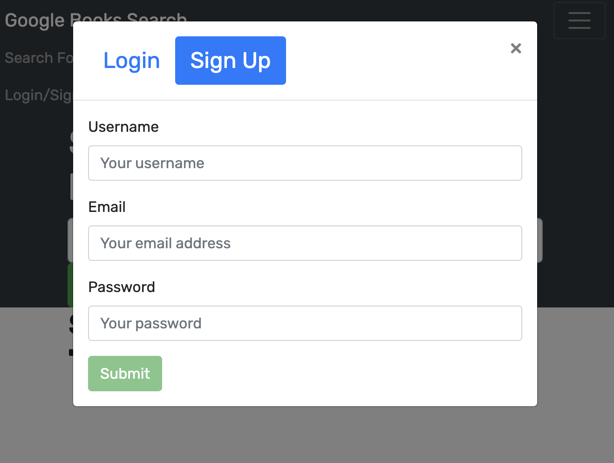

 

# book-library-search
 

## Description
Find new books. This app was initially designed as a RESTful API and has been refactored to be built with GraphQL and the Apollo Server.
Check out [the deployed link](https://secret-citadel-86135.herokuapp.com/ ) on Heroku.
 

## Table of Contents
* [Installation](#installation)
* [Usage](#usage)
* [Contributing](#contributing)
* [Tests](#tests)
* [Questions](#questions)
 

## Installation
To install necessary dependencies, run the following command:
`npm i`
 

## Usage
To run the app locally use `npm run develop` to launch application.
 
Open Insomnia to test routes.
 
To accesss the deployed link on Heroku check it out [linked here](https://secret-citadel-86135.herokuapp.com/ )
 

 

 

 
## License
This is a project under the MIT license.
 

## Contributing
Starter code provided by UC Berkeley Extensions Fullstack Development Bootcamp.
 

## Tests
To run tests, run the following commands
`npm run test`
 

## Questions
If you have any questions about the repo or project, please contact me directly at maliayraguen@gmail.com.
